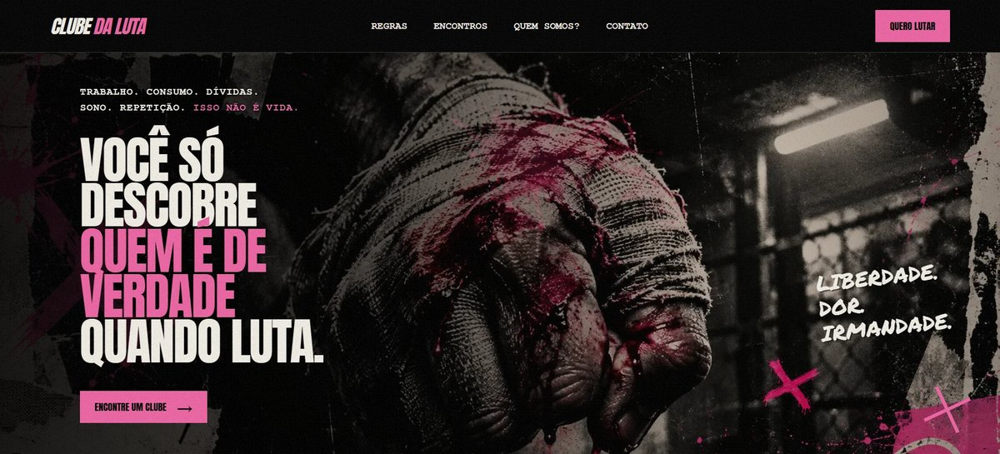

# Clube da Luta — Landing Page

Landing page temática inspirada no filme **Clube da Luta** (*Fight Club*, 1999), criada como projeto do módulo de Engenheiro Front-End da [EBAC](https://ebaconline.com.br).

🔗 **Site publicado:** https://clube-da-luta-delta.vercel.app



## Sobre o projeto

Uma página com estética de recorte, fita adesiva e película granulada, que apresenta o "clube" em seções:

- **Hero** com chamada para ação
- **01 · As regras do clube**
- **02 · Encontre um clube** (formulário + mapa)
- **03 · Por que lutamos?** (manifesto)
- **04 · Quem somos?**
- **05 · Próximos encontros**
- **CTA final** e rodapé

## Destaques técnicos

- **HTML semântico** e CSS organizado com a metodologia **BEM**
- **Layout responsivo** com CSS Grid (`fr`) e Flexbox, com hero adaptada para caber em uma tela no celular
- **Fontes externas** hospedadas no projeto com `@font-face` (Anton e Permanent Marker)
- **Efeito de grão de filme** animado feito só com CSS + SVG (`feTurbulence`), sobre a página toda sem bloquear cliques
- **Pseudo-classes** `:nth-child()` e `:last-child` para estilizar listas
- **Imagens otimizadas** com **Imagemin** (WebP), `loading="lazy"` e dimensões definidas
- **Acessibilidade:** textos alternativos, `aria-label` e `aria-hidden` em elementos decorativos, respeito a `prefers-reduced-motion`
- **Open Graph** para prévia ao compartilhar o link e **favicon** em pixel art
- **Deploy** na Vercel

## Tecnologias

HTML5 · CSS3 · JavaScript · Imagemin · Vercel

## Como rodar localmente

Basta abrir o `index.html` no navegador.

Para regenerar as imagens otimizadas (a partir de `img-original/`):

```bash
npm install
node otimizar-imagens.mjs
```

## Autor

Feito por **Well** — [site pessoal](https://site-pessoal-sandy.vercel.app) · [GitHub](https://github.com/well-wander)

---

**Palavras-chave:** landing page, front-end, HTML, CSS, BEM, responsivo, Clube da Luta, Fight Club, EBAC, Imagemin, Vercel
