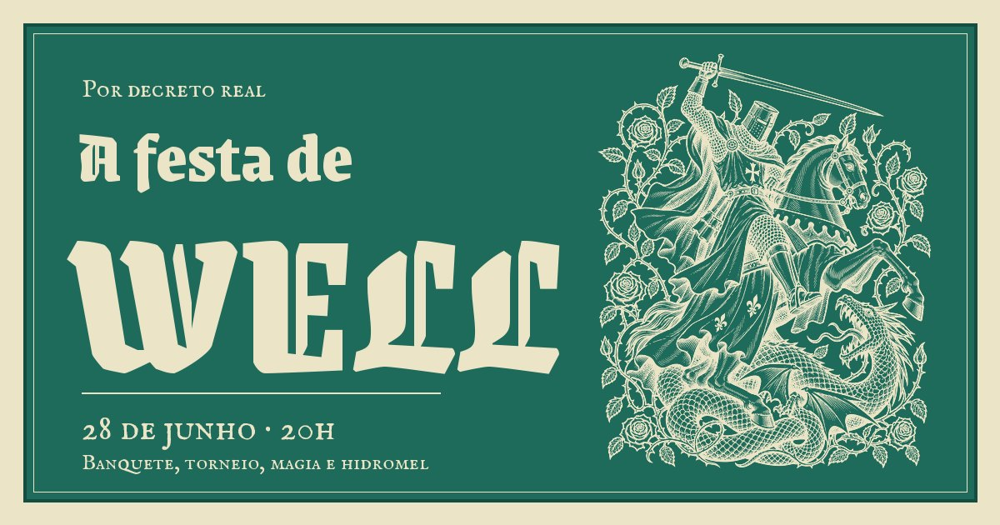

# A Festa de Well — Landing Page de Evento

Landing page da festa de aniversário do Well (**28 de junho**) com temática medieval, criada como exercício do módulo de responsividade do curso de Engenheiro Front-End da [EBAC](https://ebaconline.com.br).

🔗 **Site publicado:** https://festa-de-well.vercel.app



## Sobre o projeto

O visual segue a estética de **pôster medieval impresso em duas cores** (verde-petróleo e creme): gravuras em estilo xilogravura, tipografia gótica, textura de papel envelhecido, tinta gasta e grão de impressão.

Seções:

- **Hero em formato de pôster** com contagem regressiva até a festa, informações (local, preço e data) e botão de compra do convite
- **I · O Banquete Real**
- **II · O Grande Torneio**
- **III · A Hora da Magia**
- **IV · Bardos e Hidromel**
- **Convites** em três categorias (Aldeão, Cavaleiro e Realeza)

## Destaques técnicos

- **Responsividade** com breakpoints em `1024px` e `640px`: o pôster do hero troca o título vertical por horizontal no celular, as seções viram coluna e os botões ocupam a largura toda. Testado sem rolagem lateral de 300px a 1440px.
- **SASS** organizado em parciais (`_hero`, `_event`, `components/_buttons`…), com variáveis, mixins e metodologia **BEM** aninhada (`&__elemento`, `&--modificador`).
- **Contagem regressiva** em JavaScript com `new Date()`, `getTime()`, `setInterval` e `clearInterval`. A data é sempre o próximo 28 de junho (fuso de Brasília), então o contador nunca expira.
- **`linear-gradient`** nas superfícies de papel e tinta, combinado com texturas.
- **Seções em cards empilhados**: cada seção para no topo (`position: sticky`) e a próxima sobe por cima, com recuo do card anterior. Funciona nos dois sentidos de rolagem e respeita `prefers-reduced-motion`.
- **Animações com AOS** nos convites, entrando ao descer e saindo ao subir.
- **Imagens otimizadas** em WebP com transparência, tingidas na cor da seção, com `loading="lazy"` e dimensões definidas.
- **Acessibilidade**: textos alternativos descritivos, `aria-labelledby` nas seções e `role="timer"` na contagem.
- **Open Graph** para prévia ao compartilhar e **favicon** em pixel art.
- **Parcel** como empacotador e deploy na **Vercel**.

## Tecnologias

HTML5 · SASS · JavaScript · Parcel · AOS · Vercel

## Como rodar localmente

```bash
npm install
npm run dev
```

Para gerar a versão de produção na pasta `dist/`:

```bash
npm run build
```

## Autor

Feito por **Well** — [site pessoal](https://site-pessoal-sandy.vercel.app) · [GitHub](https://github.com/well-wander)

---

**Palavras-chave:** landing page, evento, aniversário, front-end, HTML, SASS, BEM, responsivo, Parcel, medieval, EBAC, Vercel
